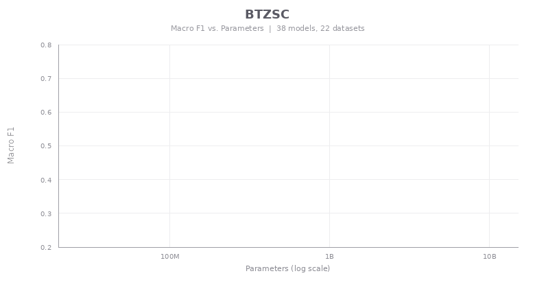

<p align="center">
	
</p>
<h1 align="center">BTZSC</h1>
<p align="center">
	<em>A unified benchmark for zero-shot text classification across embedding models, cross-encoders, rerankers, and LLMs.</em>
</p>
<p align="center">
	<a href="https://pypi.org/project/btzsc/">
		
	</a>
	<a href="https://pypi.org/project/btzsc/">
		
	</a>
	<a href="https://github.com/IliasAarab/btzsc/actions/workflows/ci.yml">
		
	</a>
	<a href="https://github.com/IliasAarab/btzsc/actions/workflows/publish.yml">
		
	</a>
</p>
<br>

<details><summary>Table of Contents</summary>

- [Overview](#overview)
- [Why BTZSC](#why-btzsc)
- [For Users](#for-users)
	- [Installation](#installation)
	- [Quick Start (Python API)](#quick-start-python-api)
	- [Quick Start (CLI)](#quick-start-cli)
	- [Supported Model Types](#supported-model-types)
	- [Dataset](#dataset)
	- [Extending with Custom Models](#extending-with-custom-models)
- [For Developers](#for-developers)
	- [Developer Setup](#developer-setup)
	- [Project Structure](#project-structure)
	- [Quality Checks](#quality-checks)
	- [Packaging and Release](#packaging-and-release)
- [Notes](#notes)
- [License](#license)

</details>
<hr>

## Overview

BTZSC is a benchmark package for evaluating zero-shot text classification models under a unified interface.
It helps you compare very different model families using the same datasets, task groupings, and metrics.

The package includes:

- Dataset loaders for BTZSC benchmark tasks.
- A shared benchmark runner across model adapters.
- Built-in adapters for embedding, NLI, reranker, and LLM-style models.
- Baseline comparison utilities and a CLI for reproducible evaluation.

## Why BTZSC

Zero-shot text classification pipelines often mix multiple paradigms (bi-encoders, cross-encoders, rerankers, generative LLMs).
BTZSC gives you one consistent evaluation path so you can answer practical questions like:

- Which architecture family works best for my task mix?
- How does a new model compare to published baselines?
- What are the trade-offs across sentiment, intent, topic, and emotion tasks?

## For Users

### Installation

Choose the installation flow that matches your environment.

Install with `pip`:

```bash
pip install btzsc
```

Install with `uv` in an existing project:

```bash
uv add btzsc
```

Run as a standalone CLI tool with `uvx` (no project install needed):

```bash
uvx btzsc list-datasets
```

### Quick Start (Python API)

```python
from btzsc import BTZSCBenchmark

benchmark = BTZSCBenchmark(tasks=["sentiment", "topic"])
results = benchmark.evaluate(
	model="intfloat/e5-base-v2",
	model_type="embedding",
	batch_size=64,
)

print(results.summary())
print(results.per_dataset())

# Compare against bundled baselines
print(results.compare_baselines(metric="f1"))
```

### Quick Start (CLI)

```bash
btzsc evaluate --model intfloat/e5-base-v2 --type embedding --tasks sentiment,topic
btzsc baselines --metric f1 --top 10
btzsc list-datasets
btzsc list-model-types
```

Export leaderboard-ready JSON:

```bash
btzsc evaluate \
	--model intfloat/e5-base-v2 \
	--type embedding \
	--output-json results/embedding/e5-base-v2.json
```

Validate a result JSON locally:

```bash
btzsc validate-result results/embedding/e5-base-v2.json
```

### Supported Model Types

BTZSC currently supports these adapter families:

- `embedding`
- `nli`
- `reranker`
- `llm`

Pass the model type explicitly (`model_type` in Python or `--type` in CLI).

### Dataset

BTZSC benchmark data is available on Hugging Face:

https://huggingface.co/datasets/btzsc/btzsc

The dataset stores rows as `(text, hypothesis, labels)` where `labels` is binary entailment.
The package reconstructs grouped multiclass samples internally for evaluation.

### Extending with Custom Models

Subclass `BaseModel` and implement:

- `predict_scores(texts, labels, batch_size)`
- `predict(texts, labels, batch_size)`

Then pass your instance to `BTZSCBenchmark.evaluate()`.

## For Developers

### Developer Setup

```bash
git clone https://github.com/IliasAarab/btzsc.git
cd btzsc
uv sync --dev
```

### Project Structure

High-level layout:

- `src/btzsc/benchmark.py`: benchmark orchestration and result objects.
- `src/btzsc/data.py`: dataset loading and task grouping.
- `src/btzsc/metrics.py`: metric computation and summaries.
- `src/btzsc/baselines.py`: baseline loading and comparison table creation.
- `src/btzsc/models/`: model adapters (`embedding`, `nli`, `reranker`, `llm`).
- `src/btzsc/cli.py`: command-line interface.

### Quality Checks

Run formatting, linting, and typing checks before opening a PR:

```bash
uv run ruff format
uv run ruff check
uv run pyright
```

### Packaging and Release

Build locally:

```bash
uv build
```

Release process:

1. Bump `version` in `pyproject.toml`.
2. Commit and push to `main`.
3. Create and push a version tag, for example:

```bash
git tag v0.1.1
git push origin v0.1.1
```

GitHub Actions builds and publishes tagged releases to PyPI via trusted publishing.

## Notes

- Baseline tables are bundled from the published BTZSC paper runs.

## License

Released under the Apache-2.0 license.
